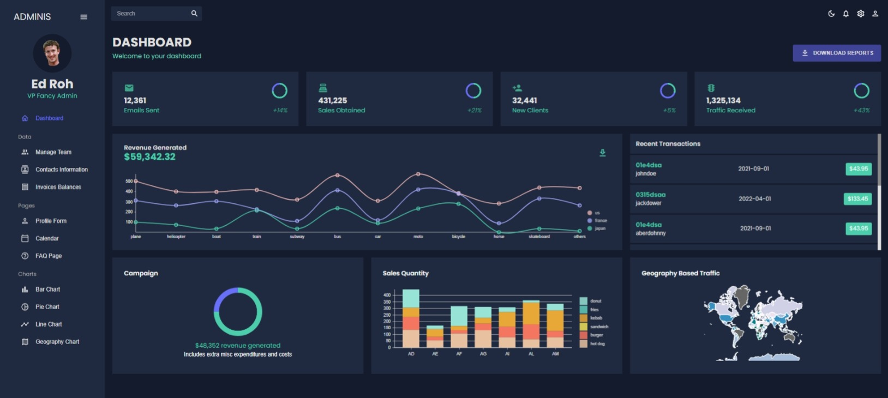
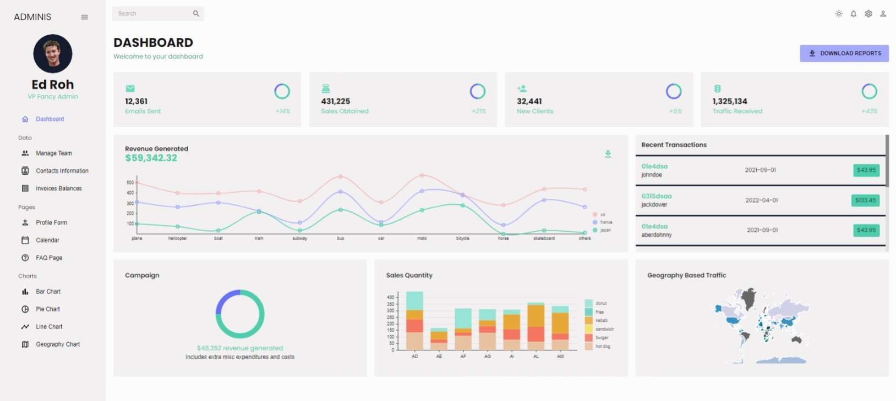

# ReactJS Admin Dashboard

## Overview

This is a modern and customizable admin dashboard built using ReactJS. It provides a user-friendly interface for managing and monitoring various aspects of your application or website. Whether you need to handle user data, track analytics, or manage content, this dashboard has got you covered.

The dashboard is designed to be responsive and accessible, ensuring it works seamlessly on different devices and screen sizes. It's also built with scalability in mind, allowing you to easily extend and adapt it to suit your specific needs.

## Features

- **Responsive Design:** The dashboard adapts to various screen sizes, ensuring a smooth experience on desktop, tablets, and mobile devices.

- **Customizable Components:** Easily customize and extend the components to match your application's branding and style.

- **Data Visualization:** Utilize the built-in charts and graphs to visualize data and track important metrics.

- **User Management:** Efficiently manage user accounts, permissions, and roles.

- **Analytics:** Keep track of key performance indicators and gain insights into user behavior.

- **Content Management:** Organize and update your content with ease.

## Getting Started

Follow these steps to get the dashboard up and running on your local machine:

1. **Clone the Repository:** Use `git clone` to clone this repository to your local machine.

2. **Install Dependencies:** Navigate to the project directory and run `npm install` to install the required dependencies.

3. **Start the Development Server:** Execute `npm start` to launch the development server and view the dashboard in your browser at `http://localhost:3000`.

## Configuration

The dashboard can be easily configured to suit your needs. Here are some configuration options:

- **Theme Customization:** Adjust the colors, typography, and overall theme to match your brand.

- **Data Source Integration:** Connect the dashboard to your preferred backend or API for real-time data updates.

- **Routing and Navigation:** Modify the navigation structure and routing to reflect your application's flow.

## Deployment

When you are ready to deploy the dashboard to a production environment, follow these steps:

1. **Build the Project:** Use `npm run build` to create a production-ready build of the project.

2. **Serve the Build:** Deploy the build files using a web server of your choice.

---

Thank you for considering our ReactJS Admin Dashboard. We hope it proves to be a valuable asset for managing your application with ease. If you have any questions or need assistance, feel free to contact us.

Happy coding! :rocket:
